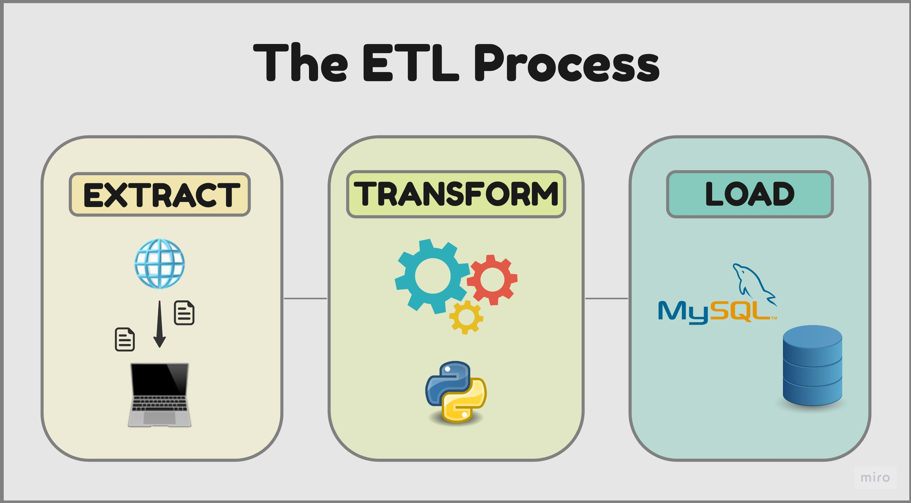

# Proyecto Individual 1- Data 04- Soy Henry   
## Data Engineering

## Welcome!

En este proyecto realizo un proceso de ETL (extract, transform and load) a partir de archivos que contienen infomación sobre los precios de productos de supermercados de distintas sucursales de Argentina en el año 2020.

- Extract: Los archivos son descargados de internet. Estos contienen información de las sucursales, los productos y los precios para distintas semanas.

- Transform: Estos archivos contienen datos mal cargados, duplicados, de diferentes extensiones, etc., por lo que se realiza una limpieza y normalización de los mismos utilizando el lenguaje Python y su librería Pandas.

- Load: Teniendo los datos limpios, se crea una base de datos conectando Python con MySQL, donde finalmente se cargan los datos.

## Extract & Transform

En el jupyter notebook "explicacion_ET.ipynb" se encuentran los pasos que seguí, el análisis y razonamiento para el tratamiento de los datos. Luego cree la función "transform" (se encuentra en common.transfom.py) para generalizar la transformación de cualquiera de los archivos.

## Load

En el jupyter notebook "creacion_db.ipynb" se encuentra el código para la creación de la base de datos conectando Python con MySQL. En principio se crea la base con las tablas vacías. Hay una tabla para las distintas sucursales, otra para los productos y otra para los precios que se irá actualizando a medida que se cargan los datos para las distintas semanas.

Luego se realiza la "carga inicial" en la que se suben los datos de los productos y las sucursales.

Finalmente se realizan las "cargas semanales" en orden cronológico. Utilizando la función update_table (common.update_table.py) se actualizan los nuevos precios de los productos o se insertan en el caso que haya nuevos productos.

A continuación se encuentra el diagrama de entidad relacional (DER) de la base de datos.

